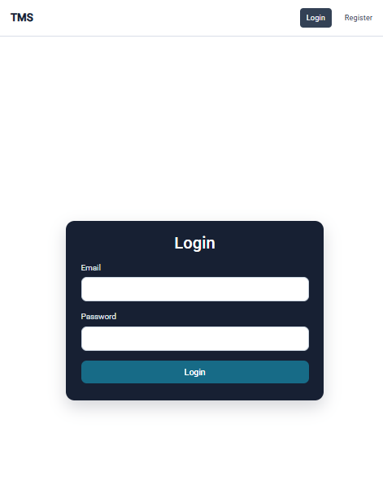
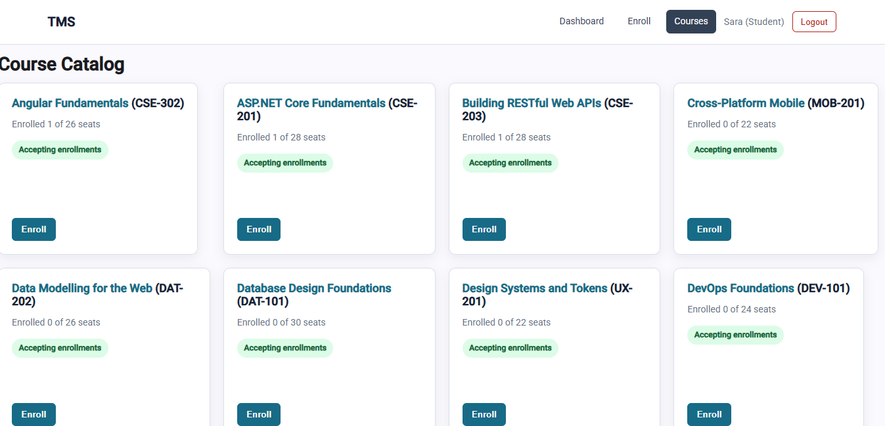
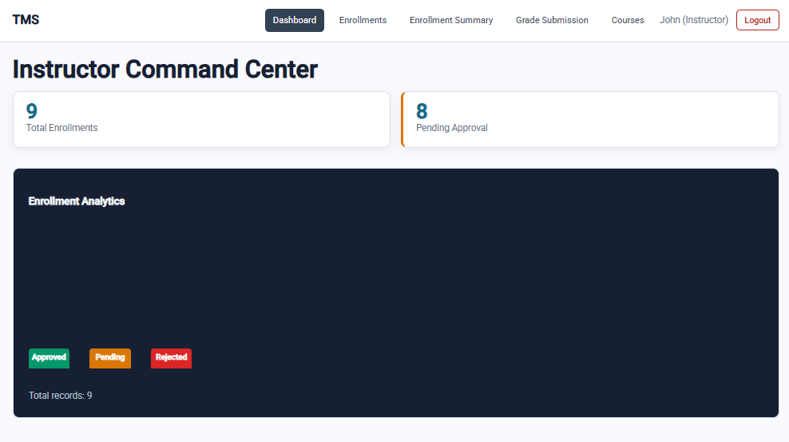
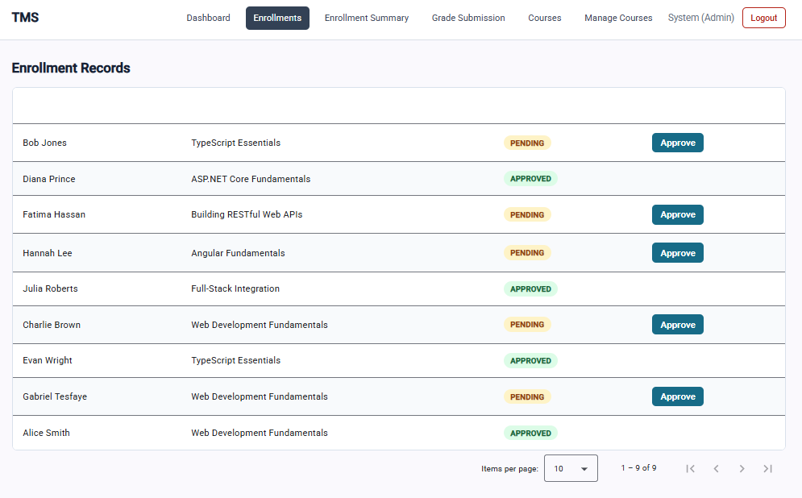

# Training Management System Client

The TMS client is an Angular 22 application for students, instructors, and administrators. It provides role-aware navigation, course browsing, enrollment workflows, instructor enrollment management, grade submission, and live enrollment status updates.

## Features

- JWT login, registration, logout, and refresh-token session restoration
- Role-aware routes for students, instructors, and administrators
- Course catalog and course details
- Student enrollment submission
- Instructor enrollment review and approval
- Enrollment summary and grade submission screens
- Angular SignalStores for course and enrollment state
- HTTP service tests and component tests with Vitest
- SignalR client integration for live enrollment updates

## Technology

- Angular 22, TypeScript 6, RxJS
- Angular Material and CDK
- NgRx Signals
- Vitest through the Angular CLI
- ASP.NET Core TMS API

## Prerequisites

- Node.js compatible with the project toolchain
- npm 10+
- A running TMS API

## Installation

From this directory:

```bash
npm install --legacy-peer-deps
```

The legacy peer-dependency option is currently required because the project uses Angular 22 with the existing NgRx Signals 21 dependency.

## Configuration

Development configuration is stored in `src/environments/environment.development.ts`:

```text
/api       Authentication, enrollments, grades, and shared endpoints
/api/v2    Version 2 courses and enrollment commands
```

The Angular development server uses `proxy.conf.json` to forward API requests to the local ASP.NET Core API. Start the API before testing authenticated features.

## Running the application

```bash
npm start
```

Open `http://localhost:4200`. The API should be running separately at `http://localhost:5249`.

## Production build

```bash
npm run build
```

The optimized output is generated under `dist/`.

## Tests

Run the Angular/Vitest suite in watch mode:

```bash
npm test
```

Run once for evaluation:

```bash
npm test -- --watch=false
```

Focused M12 enrollment.service.spec.ts & course-card.component.spec.ts:

```bash
npx ng test --include src/app/services/enrollment.service.spec.ts --watch=false
npx ng test --include src/app/ui/course-card/course-card.component.spec.ts --watch=false
```

The focused tests cover HTTP request contracts for `EnrollmentService` and signal-input/output behavior for `CourseCardComponent`.

## Project structure

```text
src/app/
  features/       Feature pages and workflows
  guards/         Authentication and role guards
  interceptors/   JWT, credentials, and API error handling
  models/         Client-side API contracts
  services/       HTTP and integration services
  store/          NgRx SignalStores
  ui/             Reusable presentation components
```

## Authentication

After login, the client stores access and refresh tokens in browser local storage, restores the session on reload, and rotates both tokens through `/api/auth/refresh` when the API returns `401 Unauthorized`.

For local evaluation, the API development seeder creates the configured administrator account. See the API README for setup instructions.

## Screenshots

Add evaluation screenshots under `docs/screenshots/` and replace the filenames below.

### Login screen



### Course catalog



### Instructor dashboard



### Enrollment management


